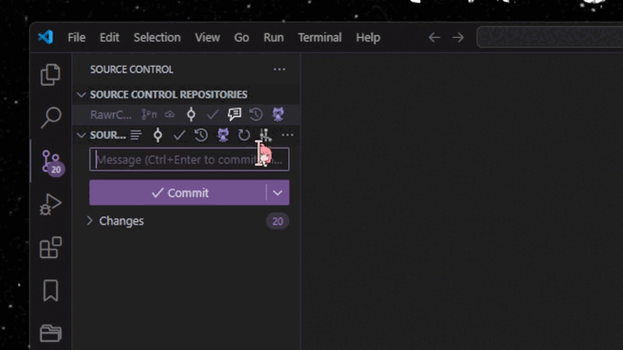

  

## USAGE

> [!WARNING]
> This extension is in BETA version, therefore some stuff might be sluggish.

1. Open the command palette (macOS: <kbd>`⌘`</kbd> + <kbd>`⇧`</kbd> + <kbd>`P`</kbd> | Win/Linux: <kbd>`⌃`</kbd> + <kbd>`⇧`</kbd> + <kbd>`P`</kbd>)
2. Search and select the `Emoji-Log` option
3. Choose the appropriate Emoji-Log prefix
4. Emoji-Log will add itself to the Git message box as a prefix
5.  Write the git commit message and commit it.
   
**ALTERNATIVELY**:

1. Open the Source Control View (where you write the Git commit message)
2. Click the Github Octopus icon in the navigation menu in the top bar
3. Choose the appropriate Emoji-Log prefix
4. Emoji-Log will add itself to the Git message box as a prefix
5. Write the git commit message and commit it.

 

## EASY INSTALLATION

1. Open the extensions sidebar on Visual Studio Code
2. Search for **Iconical.rawrcommit**
3. Click **Install** to install it.
4. 🌟 [Rate five-stars](https://marketplace.visualstudio.com/items?itemName=Iconical.rawrcommit&ssr=false#review-details).

#### ALTERNATE INSTALLATION

1. Launch Quick Open using <kbd>COMMAND (⌘)</kbd>+<kbd>P</kbd> OR <kbd>CONTROL (⌃)</kbd>+<kbd>P</kbd>.
2. Paste the command `ext install Iconical.rawrcommit`
3. Click **Install** to install it.
4. 🌟 [Rate five-stars](https://marketplace.visualstudio.com/items?itemName=Iconical.rawrcommit&ssr=false#review-details).

 